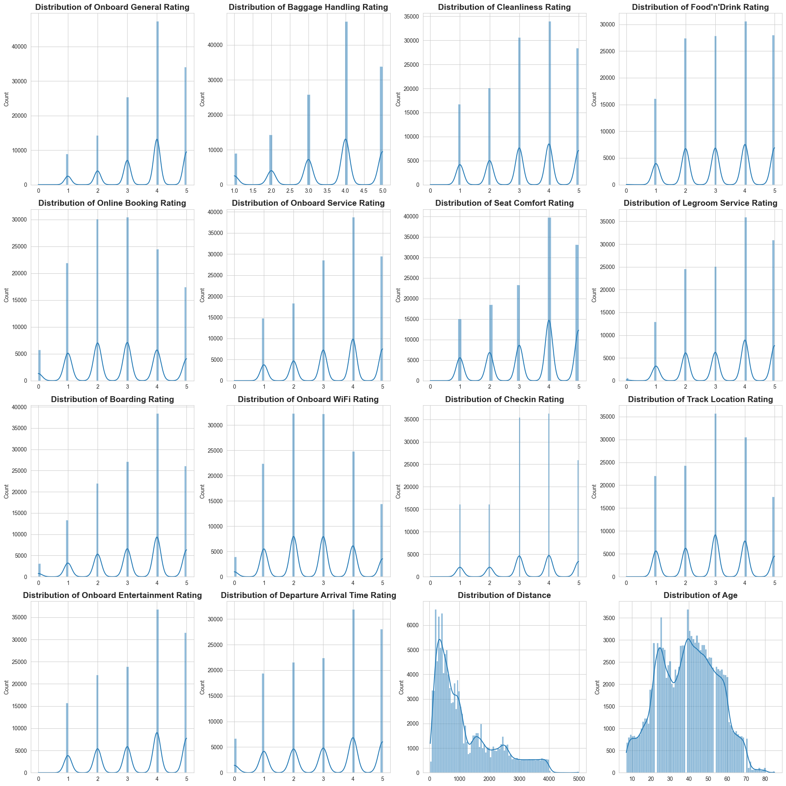
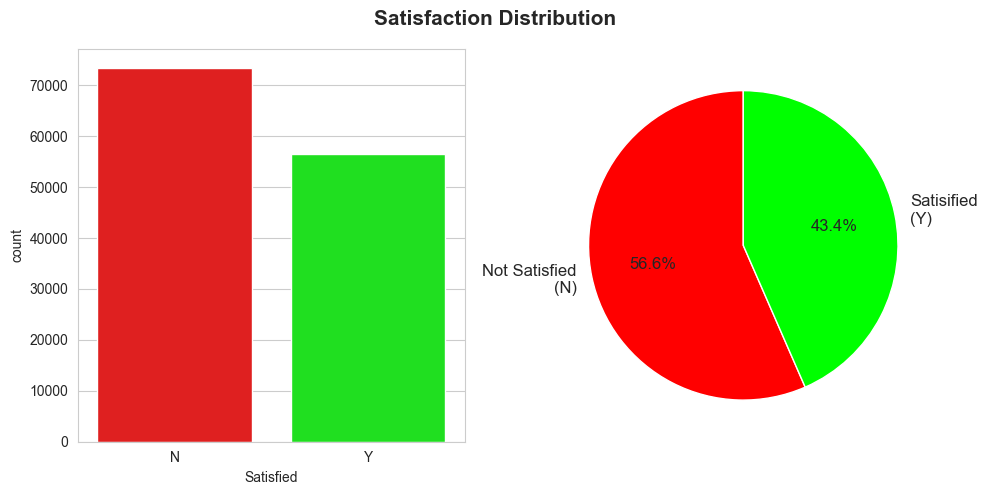
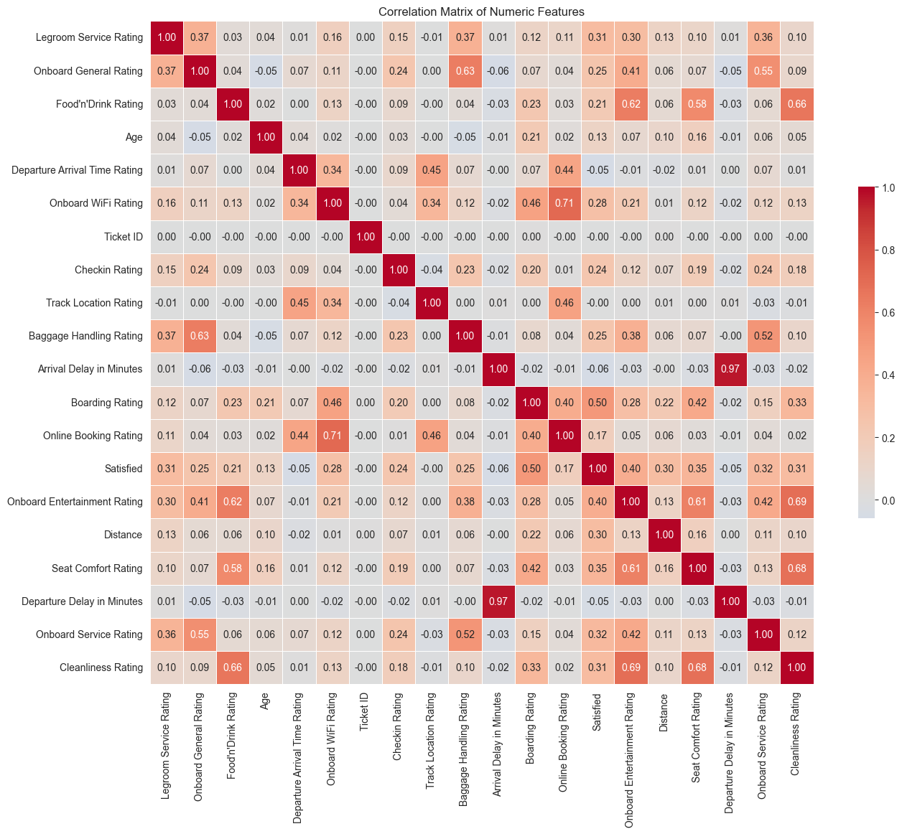
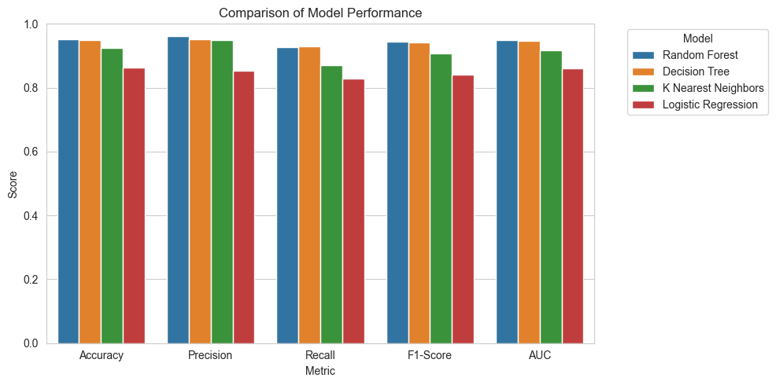
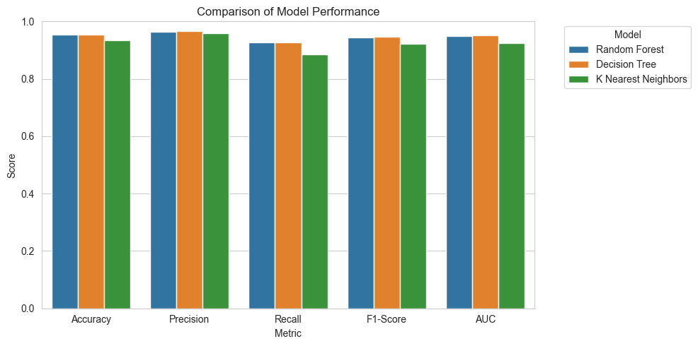

# **Trains - Artificial Intelligence and Machine Learning Project**🚆

## Group Members

Pierpaolo Ceccarelli 284451

Andrea Contino 284471

Piergiorgio Zannella 284951

## Introduction🚂

Our project aims at augmenting the prediction of customer satisfaction for the train company by integrating machine learning and data science techniques with customer service insights. Our project dives into the "trains.csv" dataset, which encompasses a variety of variables including demographic details, travel information, and service ratings. The primary objective is to deduce customer satisfaction levels indirectly through analysis of the data, as opposed to relying solely on direct customer feedback, to effectively target users with promotions and making the retention higher.

In the initial phase, we conducted an exploratory data analysis (EDA) to unearth trends and interconnections within the data. To prepare the dataset for effective machine learning modeling, we undertook several preprocessing steps such as treating missing values, converting categorical data into a usable format, and eliminating data outliers. 

Our aim was to construct machine learning models that could accurately categorize customers into "satisfied" or "unsatisfied" groups, to grasp the nuanced factors influencing customer satisfaction. This was achieved through a combination of data preprocessing, analysis, and the application of machine learning techniques.

## Methods 🔍

In this section, we outline the methods used for our project. Our approach involved a blend of data handling, visualization, and machine learning techniques.

- First we conducted Exploratory Data Analysis (EDA) to take a look at our data features and properties. We started with the basics, utilizing Pandas for managing our dataset, for visualization we turned to Matplotlib and Seaborn, essential for designing plots and statistical graphs. After loading our dataset into a Pandas DataFrame, we took a look into its structure. This step was crucial for setting up our subsequent analysis and to have a general understanding of the distributions. 

- We graphed the distribution of categorical features among which the target variable “Satisfied”, through histograms and pie charts to give us insights into the distribution of this type of data. 

- Then we dove into the dataset by looking at its shape, data types, missing values, and unique values. This comprehensive overview helped us in tailoring our preprocessing strategies, for instance in the decision to remove or integrate the Nan values.

- The categorical 'Satisfied' column was encoded into numerical values (0 and 1), a necessary step for the classification models we intended to use. 

- Then we plotted a correlation heatmap to get the most correlated features to our target variable. It helped us pinpoint which variables might be key players. 

After completing the EDA and correlation analysis we started to process our data to fit into the models.

- First using a threshold we removed some features that had a really low correlation with the target variable and removed the target variable from the data.

- Then through the use of a model pipeline we made sure that the categorical data where encoded and we scaled all the data to be evenly usable for training.

- As the last step of processing we finally divided train and test in a common 80%/20% split between training and test set. Then we further partitioned the training data to create a validation set that was essential to make an initial unbiased model evaluation.

With the data processing done we started testing with the some base models: Logistic Regression, K Nearest Neighbour, Decision Tree and Random Forest.

- We trained each model on our dataset, evaluating their performance using a validation set. Through this testing we made sure that the models we chose suited the type of classification problem that we are working on.

- After analising the metrics that we chose, we concluded that one model (Logistic Regression) was clearly under performing compared to the other three models and consequentially we chose to not look further in it.

After skimming through this models we started the hyperparameter tuning.

- For each of the best models we performed hyperparameter tuning by first using Randomized Search to get an idea of a small range of parameters around the ones that are found to be the best.

- Then by using Grid Search we input this previously found range and get parameters that improve the performance of the model.

- For each of the models we made sure that the parameters had the best possible outcome in the metrics score and we made sure that through the cross validation of the searches the results where consistent.

In the end we tested the best three models on the test set and witnessed that through the hyperparameter tuning we actually got better overall metrics scores.

## Experimental Design ✒️

The main purpose of our design is focused on accurately predicting customer satisfaction and identifying the most impactful features that can make us obtain accurate findings possible. To ensure this we tested four different models, five different metrics and we made sure that the tuning was on point through the process that we described above.

We're dealing with a classification problem because our target variable is categorical, indicating whether customers are satisfied or not. To tackle this we used four models:

- **Logistic Regression** 
    
    For binary classification problems with relatively simple, linear relationships between features and the target variable is a solid starting point to get information on the dataset, even if usually is not the most accurate model that is our primary goal.

- **K-Nearest Neighbors (KNN)** 
    
    Is an intuitive method that classifies a data point based on how its neighbors are classified. This model assumes that similar things exist in close proximity. In the context of customer satisfaction, it looks at the 'K' most similar customers (based on the features) to predict a customer's satisfaction. It's beneficial for capturing complex patterns without assuming a specific distribution in the data.

- **Decision Trees** 

    Offers a more flexible approach, handling complex patterns by dividing the data using a set of decision rules. This can be especially useful if there are interactions between features that affect customer satisfaction.

- **Random Forests** 

    Build upon classification trees, using an ensemble of trees to improve predictive accuracy and control over-fitting. Given the likely complexity and potential noise in customer satisfaction data, the robustness of random forests makes them a strong candidate for improving prediction performance.Selecting these four models allows us to compare a simple linear method with more complex non-linear methods, ensuring we explore both straightforward and intricate patterns in the data.

To make sure that we had a clear view on how each model was performing we chose five different metrics.

- **Accuracy**, to check the proportion of correct predictions among the total number of cases that we examined and to have a quick overview of how often the model is correct.

- **Precision**, to help us understanding the model's performance in terms of producing false alarms.

- **Recall**, to quantify how many actual positive cases were correctly identified.

- **F1-Score** provides a balance between precision and recall. It's a harmonic mean of these two metrics, useful when you need to seek a balance between identifying as many positives as possible and maintaining a high quality of positive identifications.

- **AUC Score** (Area Under the Receiver Operating Characteristic Curve), to show how well the model can distinguish between classes.

Each of these metrics addresses different aspects of a classification model's performance, offering a comprehensive evaluation when used together. This multi-metric approach ensures that the strengths and weaknesses of the model are thoroughly understood, leading to more informed decisions in model selection and further tuning.

In the end for hyperparameter tuning we made sure to look for the best parameters by first using a RandomizedSearchCV() to get a small range of parameters that we could work on through the GridSearchCV() to get a tuning that wasn't too much computationally expensive.

## Results 📑

The tree-base models (Decision Tree and Random Forest) demonstrate strong and balanced performances, making them suitable for our scenario. KNN, while effective, tends to have a noticeably lower recall, and Logistic Regression, despite being the simplest, shows some limitations in all the metrics, suggesting its use in scenarios where model simplicity and interpretability are more crucial than achieving the highest possible accuracy, so it didn't go further into the testing.

## Conclusions 💡

In the end we got three models (Random Forest, Decison Tree and K Nearest Neighbors) that all worked fairly well on the test sets (all over 92% score in every metric), making them suitable for this kind of classification problem, because it succesfully identifies satisfied and unsatified customers.

This project was a valuable learning experience to deepen our understanding of machine learning techniques and their practical applications. Through the making of the project we deeply understood the importance of all the steps involving the creation of an efficient machine learning model like EDA (Exploratory Data Analysis) and Hyperparameter Tuning.

To develop our work beyond the performance that we got it is definitely possible to use a model like a Neural Network, which can grasp really deep and complex correlations between data, or a unsupervised learning model. Furthermore we could have some more external data regarding the trains market, or more generally anything that can influence customer satisfaction, to possibly make the predictions even more accurate than the once we got through our process. To fully answer the needs of a company this steps would make a more professional and complete data prediction.
